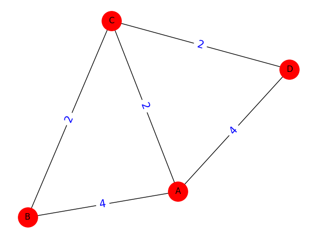
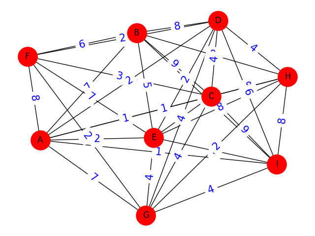

# Link State Routing Algorithm 
The Simulation of Link-State Routing Protocol is a part of the project under course EE3019 - Data Communications and Networking. The program accepts the network topology details in terms of the cost of links, and provides the shortest path tree for the network. It uses Dijkstra’s Algorithm to construct its routing table.

This program has written by using C & Python.h 

## Input of program

Input is a adjacency matrix. The adjacency matrix for undirected graphs is **always symmetric** and **Identity**

Adjacency atrix is a 2D array of size V x V where V is the number of vertices in a graph. Let the 2D array be matrix[ ][ ], a slot matrix[ i ][ j ] not equal to 0 indicates the weight of the edge from vertex i to vertex j, otherwise, matrix[ i ][ j ] = 0, do not have any edge from vertex i to vertex j

For example:

    4
    0  4  2  4
    4  0  2  0 
    2  2  0  2
    4  0  2  0
Graph of the above matrix:

    7
     0 7-1  5 -1 -1 -1
     7 0 8  9  7 -1 -1
    -1 8 0 -1  5 -1 -1
     5 9-1  0 15  6 -1
    -1 7 5 15  0  8  9
    -1-1-1  6  8  0 11
    -1-1-1 -1  9 11  0

Graph of the above matrix:

## How to build program

### Build directly
Build in linux:

    gcc src/*.c  -o build/output -I./include -I/usr/include/python3.8 -L/usr/lib/python3.8/config-3.8-x86_64-linux-gnu -lpython3.8

Build in window:

    gcc src/*.c -o build/output -I C:Python310\include -L C:Python310\libs -lpython310

Run output object in Linux/Window:

    ./build/output

### Build using Makefile
Build:

    make

Run:

    make run

Clear output file:

    make clean

